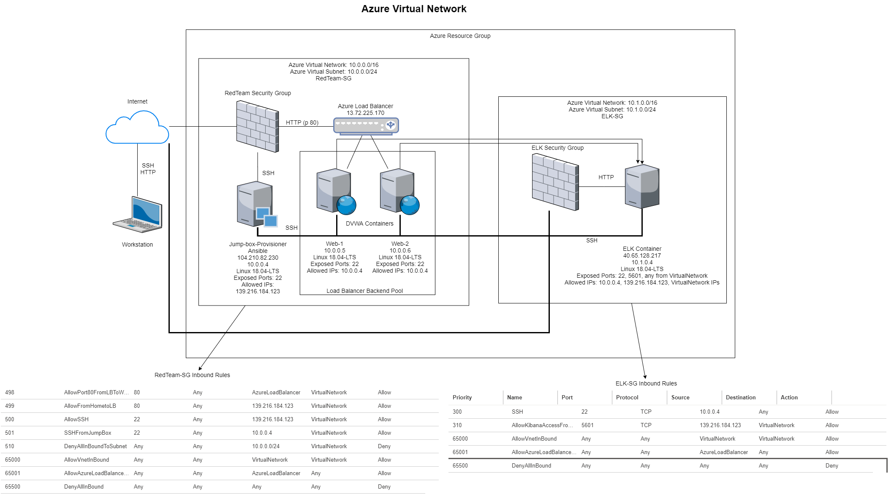
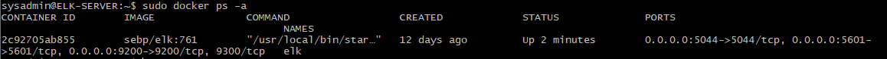

## Automated ELK Stack Deployment

The files in this repository were used to configure the network depicted below.

These files have been tested and used to generate a live ELK deployment on Azure. They can be used to either recreate the entire deployment pictured above. Alternatively, select portions of the YAML file may be used to install only certain pieces of it, such as Filebeat.

  

This document contains the following details:
- Description of the Topologu
- Access Policies
- ELK Configuration
  - Beats in Use
  - Machines Being Monitored
- How to Use the Ansible Build

### Description of the Topology

The main purpose of this network is to expose a load-balanced and monitored instance of DVWA, the D*mn Vulnerable Web Application.

Load balancing ensures that the application will be highly available, in addition to restricting access to the network.

Integrating an ELK server allows users to easily monitor the vulnerable VMs for changes to the nnetwork and system services.

The configuration details of each machine may be found below.

| Name       | Function         | IP Address | Operating System |
|------------|------------------|------------|------------------|
| Jump Box   | Gateway          | 10.0.0.4   | Linux            |
| ELK Server | ELK Stack Server | 10.1.0.4   | Linux            |
| Web 1      | Web server       | 10.0.0.5   | Linux            |
| Web 2      | Web server       | 10.0.0.6   | Linux            |

### Access Policies

The machines on the internal network are not exposed to the public Internet. 

Only the Jump Box machine can accept connections from the Internet. Access to this machine is only allowed from the following IP addresses:
- 139.216.184.123

Machines within the network can only be accessed by 10.0.0.4

A summary of the access policies in place can be found in the table below.

| Name          | Publicly Accessible | Allowed IP Addresses |
|---------------|---------------------|----------------------|
| Jump Box      | Yes                 | 139.216.184.123      |
| ELK Server    | No                  | 10.0.0.4             |
| Web 1         | No                  | 10.0.0.4             |
| Web 2         | No                  | 10.0.0.4             |
| Load Balancer | Yes                 | 139.216.184.123      |

### Elk Configuration

Ansible was used to automate configuration of the ELK machine. No configuration was performed manually, which is advantageous because the 
automated configurations will do exactly the same thing every time they run therefore eliminating much variability between configurations as possible.

The playbook implements the following tasks:
- Install docker.io
- Install python3-pip
- Install docker module
- Configure system to use more memory via sysctl
- Download and launch ELK container then open ELK published ports
- Enable docker service

The following screenshot displays the result of running `docker ps` after successfully configuring the ELK instance.

### Target Machines & Beats
This ELK server is configured to monitor the following machines:
- Web-1: 10.0.0.5
- Web-2: 10.0.0.6

We have installed the following Beats on these machines:
- Filebeat
- Metricbeat

These Beats allow us to collect the following information from each machine:
- _TODO: In 1-2 sentences, explain what kind of data each beat collects, and provide 1 example of what you expect to see. E.g., `Winlogbeat` collects Windows logs, which we use to track user logon events, etc._
- Filebeat collects data from log files, which can be used to monitor and malicious changes that may happen in those logged services.
- Metricbeat collects metrics from systems and services. For instance, it can be used to see how much a system resources a service might be using.

### Using the Playbook
In order to use the playbook, you will need to have an Ansible control node already configured. Assuming you have such a control node provisioned: 

SSH into the control node and follow the steps below:
- Clone the repo: git clone https://github.com/tiandrewthh/elk-project.git
- Update the repo for any changes: git pull
- SSH into the provisioner container
- Copy the  file to /etc/ansible/roles: cp elk-project/Ansible/install-elk.yml /etc/ansible/roles
- Update the /etc/ansible/hosts file to include: [elk] 10.1.0.4 ansible_python_interpreter=/usr/bin/python3
- Run the playbook using: ansible-playbook install-elk.yml 
- Navigate to http://[your.ELK-VM.External.IP]:5601/app/kibana to check that the installation worked as expected.

